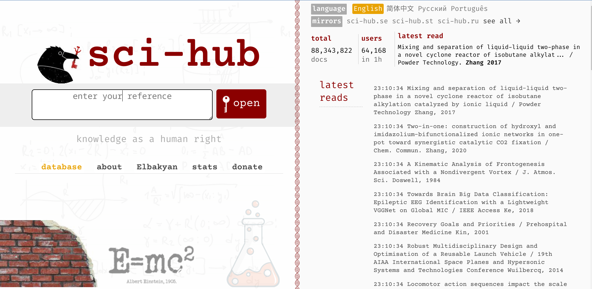
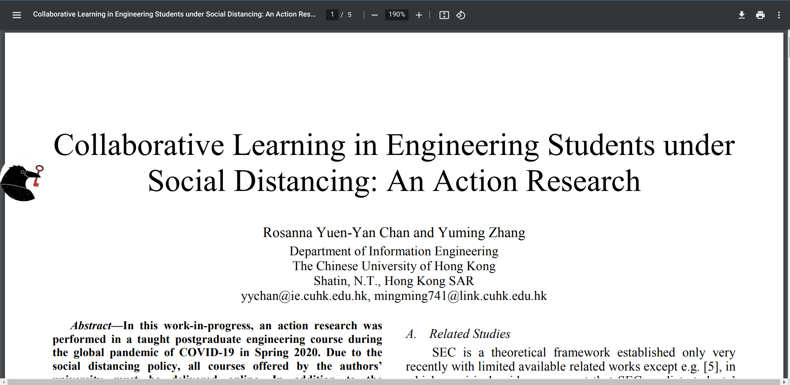

Step 1. Go to your favorite IEEE indexing website, mine is IEEE Explore

Step 2. Find related papers

Step 3. Select a paper and copy its DOI Number

Step 4. Paste that DOI number in the search bar of sci-hub.se

Step 5. If the paper is available, then a pdf view will open, else scihub will display research paper not found.

Hope this guide helps you, for research purposes.

